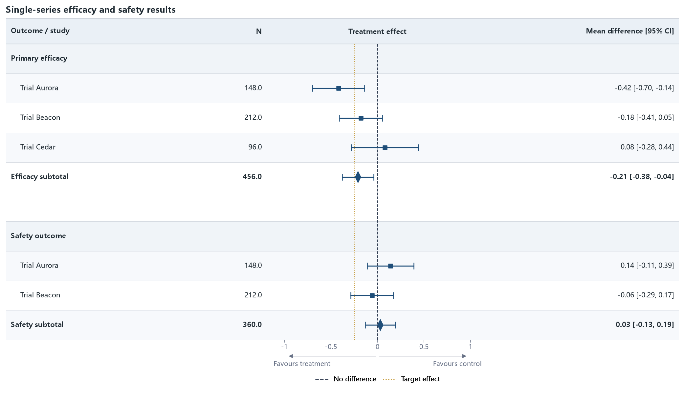

01 · Single series with trailing effect text
============================================

This is the formal “text → CI → text” regression case. The physical file places
``estimate/lower/upper`` before ``effect_display``; the ``columns`` sequence
places the CI between the study fields and the formatted effect text.

:download:`XLSX <../../tests/data/01_single_series.xlsx>` ·
:download:`CSV <../../tests/data/01_single_series.csv>` ·
:download:`PNG <../../tests/artifacts/01_single_series.png>`

Run the example
---------------

.. code-block:: python

   from forestploter import read_forest_data
   from forestploter.gallery_cases import plot_single_series

   df = read_forest_data("01_single_series.xlsx", sheet_name="Forest")
   result = plot_single_series(df)
   result.save("01_single_series.png", dpi=300)

Plot function used by the gallery and tests
-------------------------------------------

.. literalinclude:: ../../src/forestploter/gallery_cases.py
   :language: python
   :pyobject: plot_single_series
