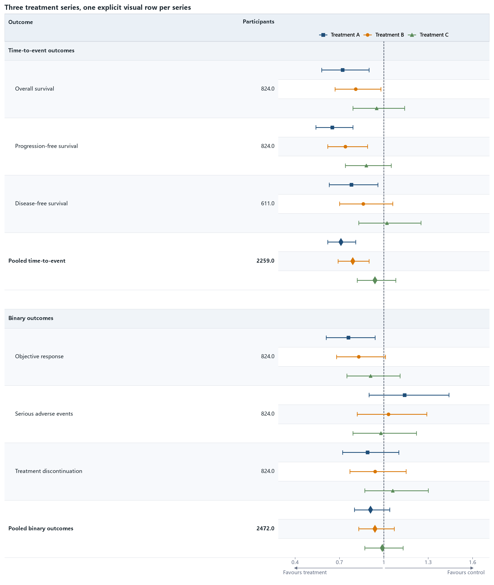

02 · Three series in one CI column
==================================

Three treatment series use three source records and three explicit visual rows
per outcome. Shared outcome and participant cells are vertically merged in the
XLSX file.

:download:`XLSX <../../tests/data/02_multi_series.xlsx>` ·
:download:`CSV <../../tests/data/02_multi_series.csv>` ·
:download:`PNG <../../tests/artifacts/02_multi_series.png>`

Run the example
---------------

.. code-block:: python

   from forestploter import read_forest_data
   from forestploter.gallery_cases import plot_multi_series

   df = read_forest_data("02_multi_series.xlsx", sheet_name="Forest")
   result = plot_multi_series(df)
   result.save("02_multi_series.png", dpi=300)

Plot function used by the gallery and tests
-------------------------------------------

.. literalinclude:: ../../src/forestploter/gallery_cases.py
   :language: python
   :pyobject: plot_multi_series
