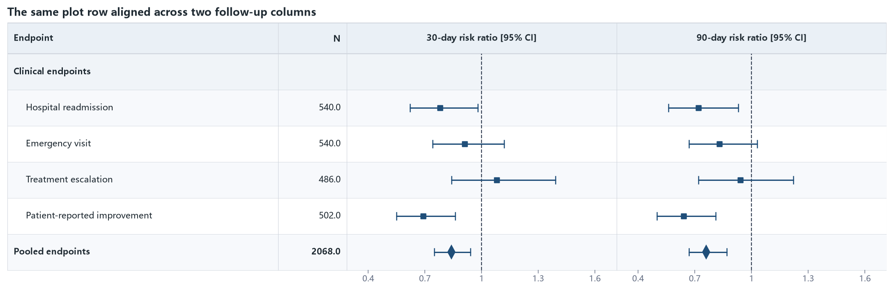

03 · One series across two CI columns
=====================================

Each endpoint has two records with the same ``_plot_row`` and different
``_ci_column`` values. The 30-day and 90-day intervals therefore share exactly
one vertical coordinate.

:download:`XLSX <../../tests/data/03_dual_ci_columns.xlsx>` ·
:download:`CSV <../../tests/data/03_dual_ci_columns.csv>` ·
:download:`PNG <../../tests/artifacts/03_dual_ci_columns.png>`

Run the example
---------------

.. code-block:: python

   from forestploter import read_forest_data
   from forestploter.gallery_cases import plot_dual_ci_columns

   df = read_forest_data("03_dual_ci_columns.xlsx", sheet_name="Forest")
   result = plot_dual_ci_columns(df)
   result.save("03_dual_ci_columns.png", dpi=300)

Plot function used by the gallery and tests
-------------------------------------------

.. literalinclude:: ../../src/forestploter/gallery_cases.py
   :language: python
   :pyobject: plot_dual_ci_columns
