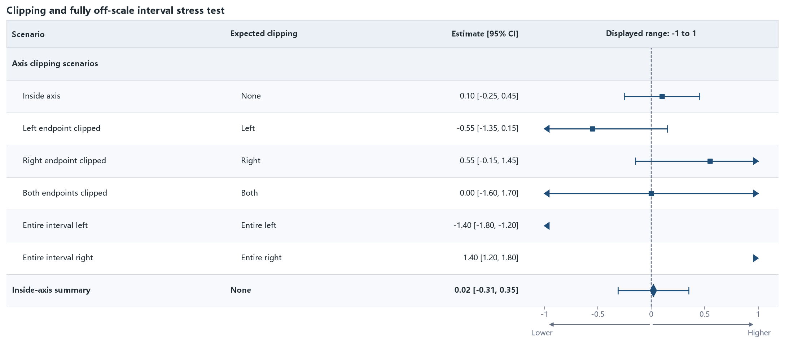

04 · Clipping stress test
=========================

This case covers intervals inside the axis, clipped on either side, spanning
both sides, and entirely outside the displayed range. An arrow replaces the
cap on each clipped side.

:download:`XLSX <../../tests/data/04_clipping_stress.xlsx>` ·
:download:`CSV <../../tests/data/04_clipping_stress.csv>` ·
:download:`PNG <../../tests/artifacts/04_clipping_stress.png>`

Run the example
---------------

.. code-block:: python

   from forestploter import read_forest_data
   from forestploter.gallery_cases import plot_clipping_stress

   df = read_forest_data("04_clipping_stress.xlsx", sheet_name="Forest")
   result = plot_clipping_stress(df)
   result.save("04_clipping_stress.png", dpi=300)

Plot function used by the gallery and tests
-------------------------------------------

.. literalinclude:: ../../src/forestploter/gallery_cases.py
   :language: python
   :pyobject: plot_clipping_stress
