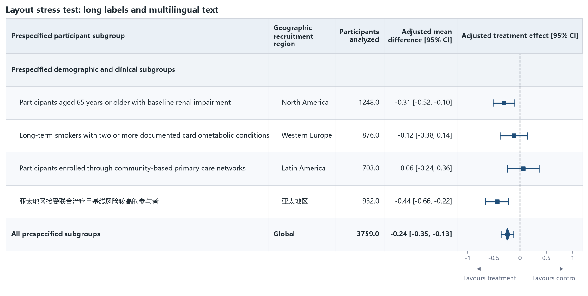

05 · Long text and multilingual layout
======================================

Long headers, long subgroup labels, Chinese/English content, automatic header
wrapping, and automatic Figure-width growth are exercised together.

:download:`XLSX <../../tests/data/05_long_layout.xlsx>` ·
:download:`CSV <../../tests/data/05_long_layout.csv>` ·
:download:`PNG <../../tests/artifacts/05_long_layout.png>`

Run the example
---------------

.. code-block:: python

   from forestploter import read_forest_data
   from forestploter.gallery_cases import plot_long_layout

   df = read_forest_data("05_long_layout.xlsx", sheet_name="Forest")
   result = plot_long_layout(df)
   result.save("05_long_layout.png", dpi=300)

Plot function used by the gallery and tests
-------------------------------------------

.. literalinclude:: ../../src/forestploter/gallery_cases.py
   :language: python
   :pyobject: plot_long_layout
