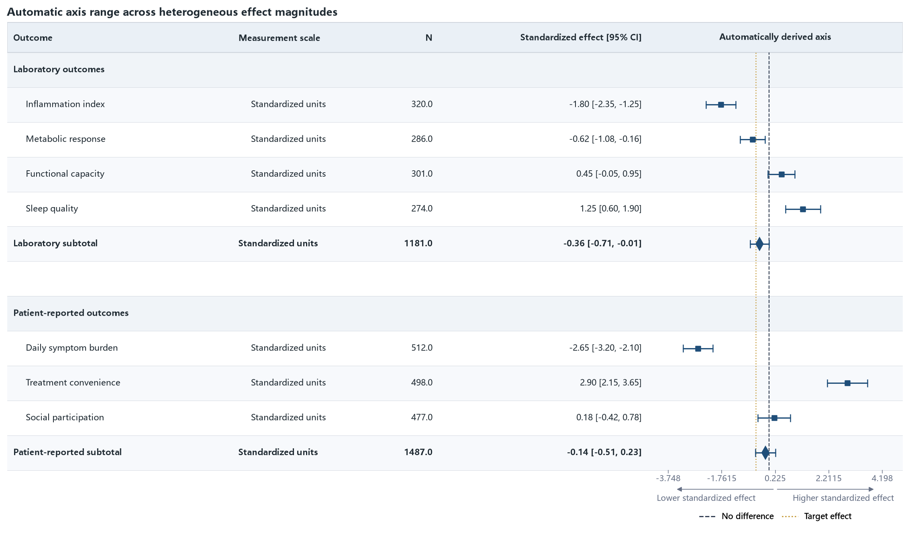

06 · Automatic axis range
=========================

Large positive and negative effects exercise automatic limits, automatic
ticks, a reference line, and an ideal-value line.

:download:`XLSX <../../tests/data/06_auto_scale_mixed_effects.xlsx>` ·
:download:`CSV <../../tests/data/06_auto_scale_mixed_effects.csv>` ·
:download:`PNG <../../tests/artifacts/06_auto_scale_mixed_effects.png>`

Run the example
---------------

.. code-block:: python

   from forestploter import read_forest_data
   from forestploter.gallery_cases import plot_auto_scale_mixed_effects

   df = read_forest_data("06_auto_scale_mixed_effects.xlsx", sheet_name="Forest")
   result = plot_auto_scale_mixed_effects(df)
   result.save("06_auto_scale_mixed_effects.png", dpi=300)

Plot function used by the gallery and tests
-------------------------------------------

.. literalinclude:: ../../src/forestploter/gallery_cases.py
   :language: python
   :pyobject: plot_auto_scale_mixed_effects
