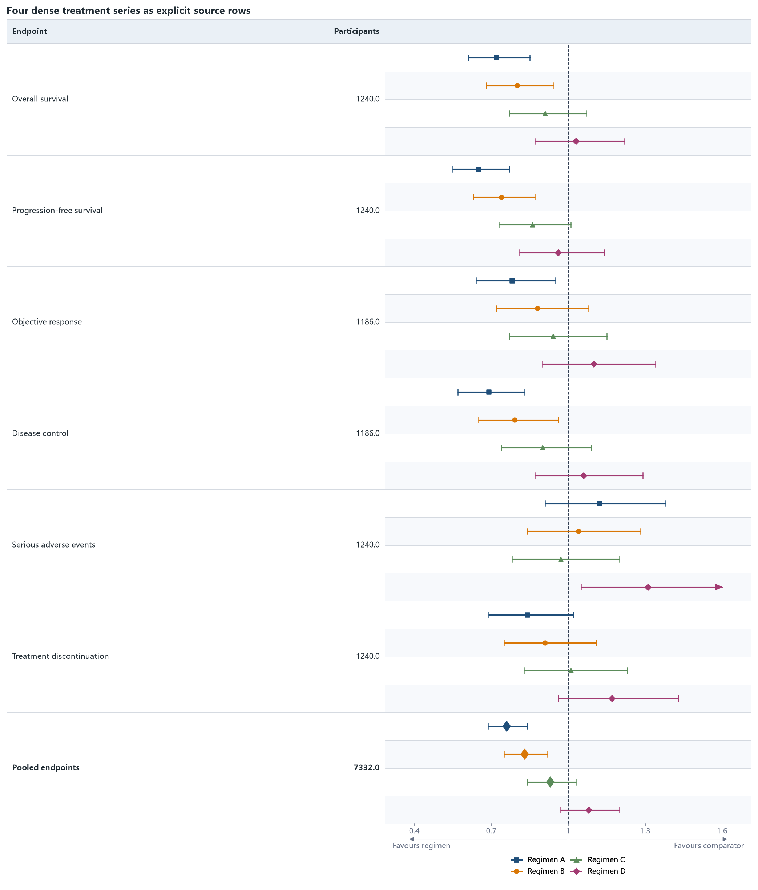

07 · Four dense series
======================

Four marker shapes, four explicit visual rows per endpoint, summary rows, a
bottom legend, and a clipped upper interval form a dense regression case.

:download:`XLSX <../../tests/data/07_four_series_dense.xlsx>` ·
:download:`CSV <../../tests/data/07_four_series_dense.csv>` ·
:download:`PNG <../../tests/artifacts/07_four_series_dense.png>`

Run the example
---------------

.. code-block:: python

   from forestploter import read_forest_data
   from forestploter.gallery_cases import plot_four_series_dense

   df = read_forest_data("07_four_series_dense.xlsx", sheet_name="Forest")
   result = plot_four_series_dense(df)
   result.save("07_four_series_dense.png", dpi=300)

Plot function used by the gallery and tests
-------------------------------------------

.. literalinclude:: ../../src/forestploter/gallery_cases.py
   :language: python
   :pyobject: plot_four_series_dense
