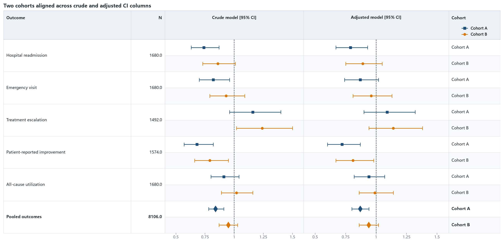

08 · Two series across two CI columns, then text
================================================

Each cohort has one visual row and two source records, one per CI column. The
``cohort`` display field is physically placed after the shared statistical
triple and rendered after both CI columns. The series legend is placed in that
trailing column's header.

:download:`XLSX <../../tests/data/08_two_by_two_ci_columns.xlsx>` ·
:download:`CSV <../../tests/data/08_two_by_two_ci_columns.csv>` ·
:download:`PNG <../../tests/artifacts/08_two_by_two_ci_columns.png>`

Run the example
---------------

.. code-block:: python

   from forestploter import read_forest_data
   from forestploter.gallery_cases import plot_two_by_two_ci_columns

   df = read_forest_data("08_two_by_two_ci_columns.xlsx", sheet_name="Forest")
   result = plot_two_by_two_ci_columns(df)
   result.save("08_two_by_two_ci_columns.png", dpi=300)

Plot function used by the gallery and tests
-------------------------------------------

.. literalinclude:: ../../src/forestploter/gallery_cases.py
   :language: python
   :pyobject: plot_two_by_two_ci_columns
