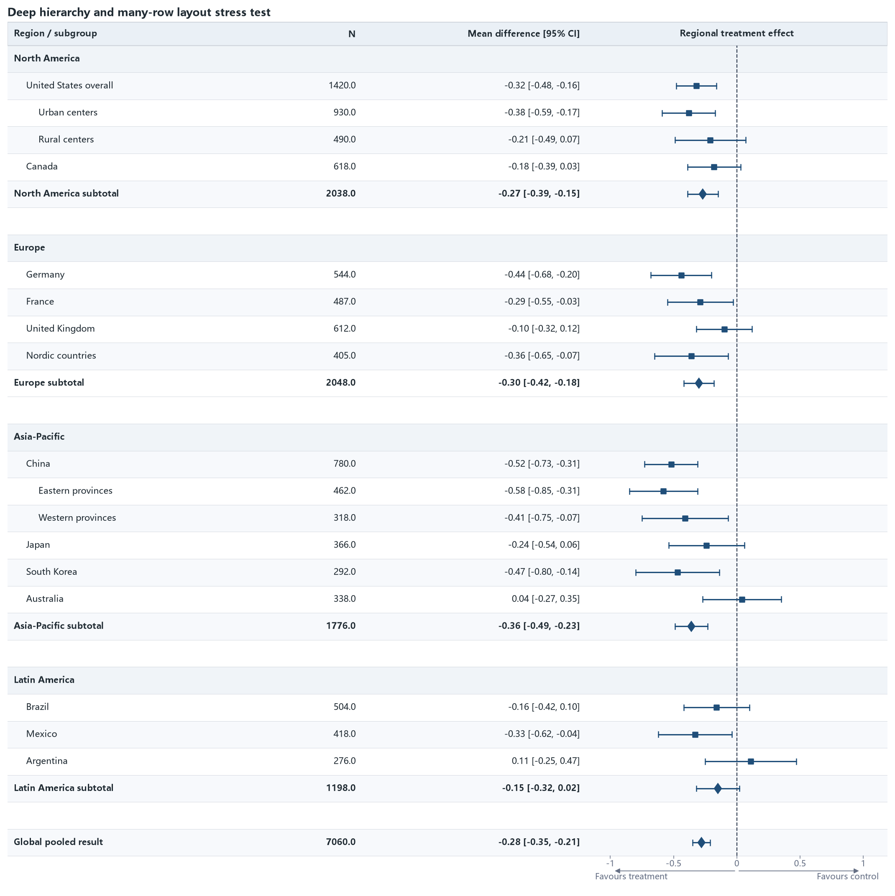

09 · Deep hierarchy and many rows
=================================

Several regions, two indentation levels, subtotals, spacer rows, and thirty
visual rows exercise vertical scaling and hierarchy readability.

:download:`XLSX <../../tests/data/09_deep_hierarchy_many_rows.xlsx>` ·
:download:`CSV <../../tests/data/09_deep_hierarchy_many_rows.csv>` ·
:download:`PNG <../../tests/artifacts/09_deep_hierarchy_many_rows.png>`

Run the example
---------------

.. code-block:: python

   from forestploter import read_forest_data
   from forestploter.gallery_cases import plot_deep_hierarchy_many_rows

   df = read_forest_data("09_deep_hierarchy_many_rows.xlsx", sheet_name="Forest")
   result = plot_deep_hierarchy_many_rows(df)
   result.save("09_deep_hierarchy_many_rows.png", dpi=300)

Plot function used by the gallery and tests
-------------------------------------------

.. literalinclude:: ../../src/forestploter/gallery_cases.py
   :language: python
   :pyobject: plot_deep_hierarchy_many_rows
