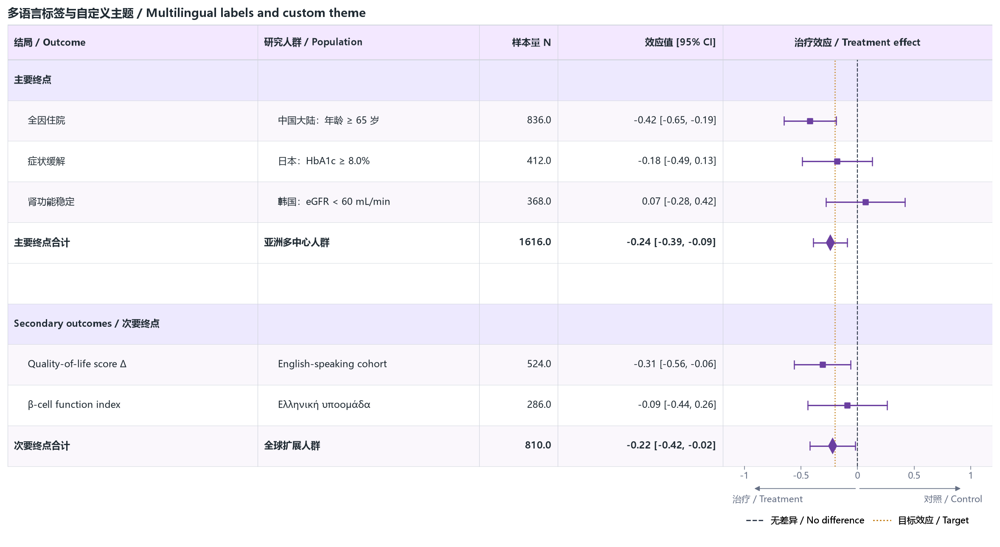

10 · Unicode labels and a custom theme
======================================

Chinese, English, Greek, mathematical symbols, custom fills, guide colors, an
explicitly enabled full table border, and font fallback behavior are exercised
together. Other gallery cases retain the borderless default unless they opt
into independent vertical column separators.

:download:`XLSX <../../tests/data/10_unicode_custom_theme.xlsx>` ·
:download:`CSV <../../tests/data/10_unicode_custom_theme.csv>` ·
:download:`PNG <../../tests/artifacts/10_unicode_custom_theme.png>`

Run the example
---------------

.. code-block:: python

   from forestploter import read_forest_data
   from forestploter.gallery_cases import plot_unicode_custom_theme

   df = read_forest_data("10_unicode_custom_theme.xlsx", sheet_name="Forest")
   result = plot_unicode_custom_theme(df)
   result.save("10_unicode_custom_theme.png", dpi=300)

Plot function used by the gallery and tests
-------------------------------------------

.. literalinclude:: ../../src/forestploter/gallery_cases.py
   :language: python
   :pyobject: plot_unicode_custom_theme
