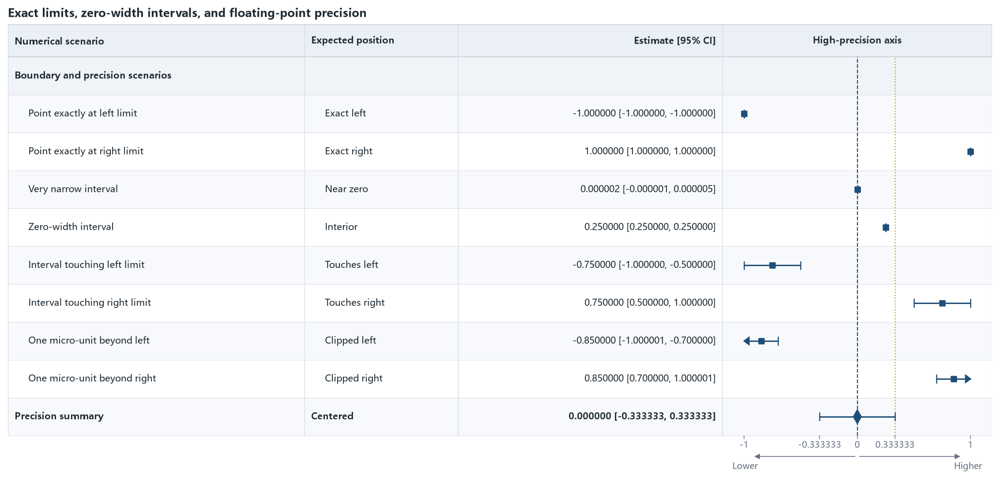

11 · Boundaries and floating-point precision
=============================================

Exact endpoints, zero-width intervals, very narrow intervals, and
one-micro-unit overflows verify clipping decisions at numerical boundaries.

:download:`XLSX <../../tests/data/11_boundary_precision.xlsx>` ·
:download:`CSV <../../tests/data/11_boundary_precision.csv>` ·
:download:`PNG <../../tests/artifacts/11_boundary_precision.png>`

Run the example
---------------

.. code-block:: python

   from forestploter import read_forest_data
   from forestploter.gallery_cases import plot_boundary_precision

   df = read_forest_data("11_boundary_precision.xlsx", sheet_name="Forest")
   result = plot_boundary_precision(df)
   result.save("11_boundary_precision.png", dpi=300)

Plot function used by the gallery and tests
-------------------------------------------

.. literalinclude:: ../../src/forestploter/gallery_cases.py
   :language: python
   :pyobject: plot_boundary_precision
