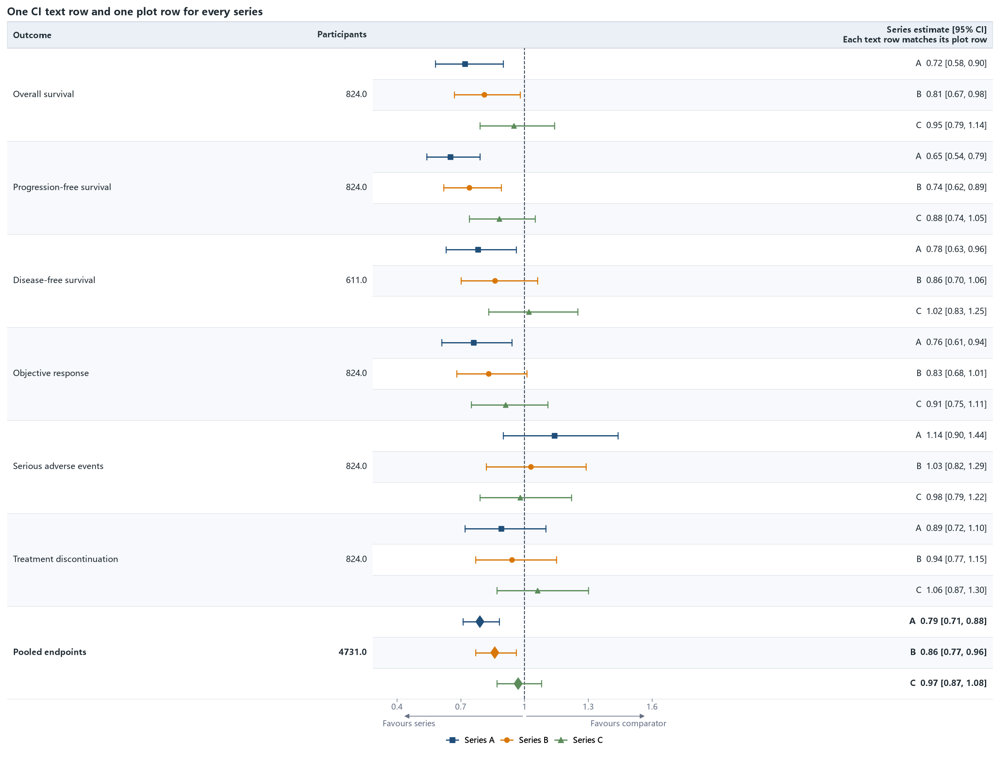

12 · Per-series CI text rows after the plot
============================================

Each of three series has its own formatted CI text cell and its own
``_plot_row``. The text column follows the CI plotting column, and every text
artist shares the exact y coordinate of its corresponding point and interval.

:download:`XLSX <../../tests/data/12_multi_series_ci_text_rows.xlsx>` ·
:download:`CSV <../../tests/data/12_multi_series_ci_text_rows.csv>` ·
:download:`PNG <../../tests/artifacts/12_multi_series_ci_text_rows.png>`

Run the example
---------------

.. code-block:: python

   from forestploter import read_forest_data
   from forestploter.gallery_cases import plot_multi_series_ci_text_rows

   df = read_forest_data("12_multi_series_ci_text_rows.xlsx", sheet_name="Forest")
   result = plot_multi_series_ci_text_rows(df)
   result.save("12_multi_series_ci_text_rows.png", dpi=300)

Plot function used by the gallery and tests
-------------------------------------------

.. literalinclude:: ../../src/forestploter/gallery_cases.py
   :language: python
   :pyobject: plot_multi_series_ci_text_rows
