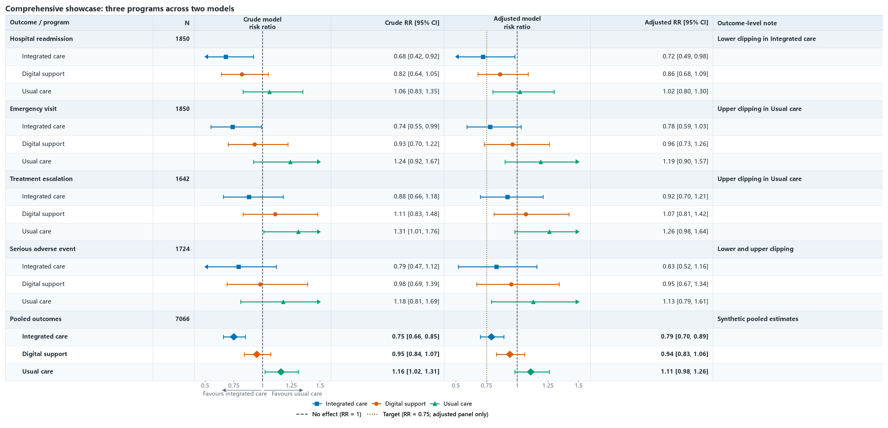

13 · Comprehensive two-column, three-series showcase
======================================================

This synthetic example combines the package's main input and rendering
features in one figure. Each outcome is a bold header row containing its shared
participant count and note; three programs appear below it as indented child
rows. Every child has matching CI text in both the crude and adjusted panels.
This workbook deliberately uses no merged cells. Lower- and upper-bound
clipping are both visible. Both panels retain the no-effect reference line,
while an additional target line appears in the adjusted panel only. Direction
labels and both the series and line legends occupy the bottom region.

Rows use compact spacing, and CI text follows the conventional
``0.68 [0.42, 0.92]`` form. Indented child labels, marker styling, and the
legend identify each series instead of repeating its name in every CI-text
cell.

:download:`XLSX <../../tests/data/13_comprehensive_showcase.xlsx>` ·
:download:`CSV <../../tests/data/13_comprehensive_showcase.csv>` ·
:download:`PNG <../../tests/artifacts/13_comprehensive_showcase.png>`

Run the example
---------------

.. code-block:: python

   from forestploter import read_forest_data
   from forestploter.gallery_cases import plot_comprehensive_showcase

   df = read_forest_data("13_comprehensive_showcase.xlsx", sheet_name="Forest")
   result = plot_comprehensive_showcase(df)
   result.save("13_comprehensive_showcase.png", dpi=300)

Plot function used by the gallery and tests
-------------------------------------------

.. literalinclude:: ../../src/forestploter/gallery_cases.py
   :language: python
   :pyobject: plot_comprehensive_showcase
